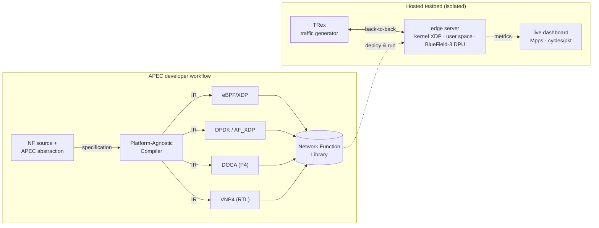

# One Network Function, Three Acceleration Layers
### A live demonstration of the APEC developer workflow

> **TL;DR** — A developer expresses a network function *once* through APEC's
> high-level programming abstraction. APEC's Platform-Agnostic Compiler turns
> that single specification into acceleration artifacts for **in-kernel
> (eBPF/XDP)**, **user-space fast-I/O (AF_XDP, DPDK)**, **DPU (NVIDIA
> BlueField-3)** and **FPGA** — the first three run live on identical
> traffic, comparing throughput and host CPU cost; the FPGA artifact is
> presented through its resource and performance estimations.

---

## 1. The problem

Edge infrastructures offer many ways to accelerate network functions (NFs),
but each target imposes its own programming model and toolchain — eBPF, DPDK,
DOCA, P4, RTL. In practice:

- NFs get **locked to the platform** they were developed for;
- comparing or migrating across executors requires **re-implementation by
  platform experts**;
- 6G edge deployments make this worse: the available acceleration hardware
  varies per site and over time.

## 2. What APEC is

**APEC** (Accelerated Programmable Edge Computing) is a unified framework that
combines high-performance CPU processing with the offloading capabilities of
programmable NICs at the 6G edge. It organises packet-processing acceleration
into **three incremental layers**:

| Layer | Technology | Where it runs |
|---|---|---|
| Fast I/O | DPDK, AF_XDP | user space, kernel bypass |
| In-kernel | eBPF/XDP | Linux kernel |
| Hardware offload | P4, RTL | SmartNICs, DPUs, FPGAs |

behind a *Semantic Programmable Abstraction Interface*: NF developers state
**what** packet data an NF consumes and **what** should be accelerated — not
**how** each target is programmed.

## 3. The developer workflow (what we demonstrate)

1. **Specify** — the developer uses APEC's programming abstraction to state,
   at the semantic level, the packet data the NF consumes and the processing
   to accelerate. The NF logic itself stays target-independent.
2. **Compile once** — the *Platform-Agnostic Compiler* (PAC) verifies the
   specification against the constraints of the available targets and lowers
   it to a platform-independent intermediate representation.
3. **Generate everywhere** — unified acceleration backends translate that
   representation into executor-specific artifacts for every layer:
   in-kernel eBPF/XDP, user-space fast I/O (AF_XDP, DPDK), a P4 pipeline for
   the BlueField-3 DPU (DOCA), and a P4-to-RTL pipeline for an FPGA SmartNIC (Vitis Networking P4).
4. **Register** — artifacts and capability metadata land in the *Network
   Function Library* (NFL), from which APEC's intent-driven orchestration
   later deploys them (the complementary *user workflow*, outside this
   demo's scope).

## 4. Live walkthrough (~10 minutes, runs in a loop)

| # | Step | What the audience sees |
|---|---|---|
| 1 | **Specify** | The NAT NF and how the packet data it consumes is expressed through APEC's abstraction; target-independent NF logic |
| 2 | **Compile once** | The PAC run; per-layer artifacts and their NFL registration metadata |
| 3 | **Software executors** | The NF running fully in-kernel (eBPF/XDP), then unchanged in user space (AF_XDP, DPDK); live dashboard starts |
| 4 | **Hardware offload** | Acceleration moves to the BlueField-3 DPU — host CPU cost visibly drops at equal NF behaviour; the DPU stage also pairs with the in-kernel executor, showing that layers compose |
| 5 | **Traffic sensitivity** | TRex switches from IPv4 to IPv6/mixed traffic — the acceleration benefit widens |
| 6 | **FPGA target** | The FPGA artifact, generated through P4 as intermediate representation, presented via its resource utilisation and performance estimations |
| 7 | **Free exploration** | Attendees pick an executor × traffic-mix combination, or another NF from the library |

**Featured NF:** a stateless source-NAT (IPv4/UDP, 5-tuple). The library also
includes an L3 forwarder, an ACL/firewall, and a Maglev-style load balancer
(see [`README.md`](README.md)).

## 5. What to take away

- **One specification, every layer** — the developer never writes eBPF, P4,
  or RTL and needs no hardware expertise.
- **Executors become interchangeable** — the same NF logic runs unchanged
  from kernel to user space to the DPU-offloaded configuration, measured
  apples-to-apples on identical traffic, and extends to the FPGA target;
  layers even compose.
- **Choosing an executor becomes an evaluation exercise**, not a
  re-implementation effort — and the benefit depends on the traffic profile,
  so measuring before committing matters.

## 6. Metrics & setup

- **Metrics:** throughput (Mpps/Gbps) and host CPU cycles/packet per
  {NF, executor, traffic mix}; resource utilisation and performance
  estimations for the FPGA artifact.
- **Traffic:** synthetically generated by [TRex](https://trex-tgn.cisco.com)
  over an isolated back-to-back link — no real user traffic, no personal
  data.
- **Testbed:** one edge server hosting the executors (host CPU + kernel,
  BlueField-3 DPU), driven remotely via screen-share; a pre-recorded run
  serves as fallback.

## References

1. F. Carloni *et al.*, "Design Principles for Accelerated Programmable Edge
   Computing in Future 6G Architectures," 2025.
2. [DPDK](https://www.dpdk.org) · [NVIDIA DOCA](https://developer.nvidia.com/doca)
   · [AMD Vitis Networking P4](https://www.amd.com) ·
   [TRex](https://trex-tgn.cisco.com)
